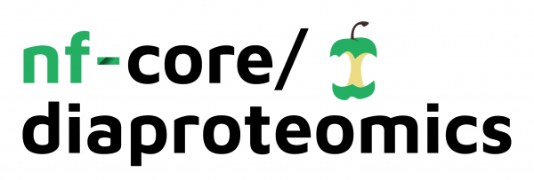
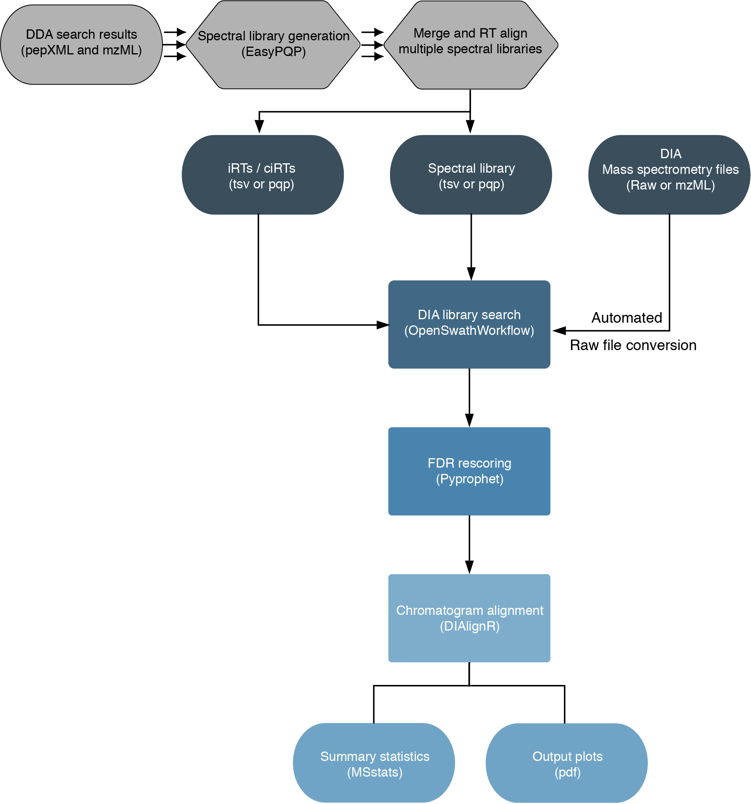

# 

**Automated quantitative analysis of DIA proteomics mass spectrometry measurements.**

[](https://github.com/nf-core/diaproteomics/actions)
[](https://github.com/nf-core/diaproteomics/actions)
[](https://www.nextflow.io/)

[](https://bioconda.github.io/)
[](https://hub.docker.com/r/nfcore/diaproteomics)
[](https://nfcore.slack.com/channels/diaproteomics)

## Introduction

nfcore/diaproteomics is a bioinformatics analysis pipeline used for quantitative processing of data independant (DIA) proteomics data ([preprint available here](https://www.biorxiv.org/content/10.1101/2020.12.08.415844v1)).

The workflow is based on the [OpenSwathWorkflow](http://openswath.org/en/latest/docs/openswath.html) for SWATH-MS proteomic data. DIA RAW files (mzML) serve as inputs and library search is performed based on a given input spectral library. Optionally, spectral libraries can be generated ([EasyPQP](https://github.com/grosenberger/easypqp)) from multiple matched DDA measurments and respective search results. Generated libraries can then further be aligned applying a pairwise RT alignment and concatenated into a single large library. In the same way internal retention time standarts (irts) can be either supplied or generted by the workflow in order to align library and DIA measurements into the same retention time space. FDR rescoring is applied using Pyprophet based on a competitive target-decoy approach on peakgroup or global peptide and protein level. In a last step [DIAlignR](https://bioconductor.org/packages/release/bioc/html/DIAlignR.html) for chromatogram alignment and quantification is carried out and a csv of peptide quantities, [MSstats](https://www.bioconductor.org/packages/release/bioc/html/MSstats.html) based protein statistics and several visualisations are exported.



## Quick Start

1. Install [`nextflow`](https://nf-co.re/usage/installation)

2. Install any of [`Docker`](https://docs.docker.com/engine/installation/), [`Singularity`](https://www.sylabs.io/guides/3.0/user-guide/), [`Podman`](https://podman.io/), [`Shifter`](https://nersc.gitlab.io/development/shifter/how-to-use/) or [`Charliecloud`](https://hpc.github.io/charliecloud/) for full pipeline reproducibility _(please only use [`Conda`](https://conda.io/miniconda.html) as a last resort; see [docs](https://nf-co.re/usage/configuration#basic-configuration-profiles))_

3. Download the pipeline and test it on a minimal dataset with a single command:

    ```bash
    nextflow run nf-core/diaproteomics -profile test,<docker/singularity/podman/shifter/charliecloud/conda/institute>
    ```

    > Please check [nf-core/configs](https://github.com/nf-core/configs#documentation) to see if a custom config file to run nf-core pipelines already exists for your Institute. If so, you can simply use `-profile <institute>` in your command. This will enable either `docker` or `singularity` and set the appropriate execution settings for your local compute environment.

4. Start running your own analysis!

    ```bash
    nextflow run nf-core/diaproteomics -profile <docker/singularity/podman/conda/institute> --input 'sample_sheet.tsv' --input_spectral_library 'library_sheet.tsv' --irts 'irt_sheet.tsv'

    ```

    OR optionally:

    ```bash
    nextflow run nf-core/diaproteomics -profile <docker/singularity/podman/conda/institute> --input 'sample_sheet.tsv' --generate_spectral_library --input_sheet_dda 'dda_sheet.tsv' --generate_pseudo_irts --merge_libraries --align_libraries
    ```

See [usage docs](https://nf-co.re/diaproteomics/usage) for all of the available options when running the pipeline.

## Pipeline Summary

By default, the pipeline currently performs the following:

* Optional spectral library generation from DDA input ('EasyPQP')
* DIA Targeted Extraction ('OpenSwathWorkflow')
* False discovery rate estimation ('Pyprophet')
* Chromatogram alignment ('DIAlignR')
* Statistical postprocessing ('MSstats')

## Documentation

The nf-core/diaproteomics pipeline comes with documentation about the pipeline: [usage](https://nf-co.re/diaproteomics/usage) and [output](https://nf-co.re/diaproteomics/output).

## Credits

nf-core/diaproteomics was originally written by Leon Bichmann.

We thank the following people for their extensive assistance in the development
of this pipeline:

Shubham Gupta, George Rosenberger, Leon Kuchenbecker, Timo Sachsenberg, Oliver Alka, Julianus Pfeuffer and the nf-core team

## Contributions and Support

If you would like to contribute to this pipeline, please see the [contributing guidelines](.github/CONTRIBUTING.md).

For further information or help, don't hesitate to get in touch on the [Slack `#diaproteomics` channel](https://nfcore.slack.com/channels/diaproteomics) (you can join with [this invite](https://nf-co.re/join/slack)).

## Citations

If you apply DIAproteomics on your data please cite:

> **DIAproteomics: A multi-functional data analysis pipeline for data-independent-acquisition proteomics and peptidomics**
>
> Leon Bichmann, Shubham Gupta, George Rosenberger, Leon Kuchenbecker, Timo Sachsenberg, Oliver Alka, Julianus Pfeuffer, Oliver Kohlbacher & Hannes Rost.
>
> bioRxiv: "https://www.biorxiv.org/content/10.1101/2020.12.08.415844v1"
>

You can cite the `nf-core` publication as follows:

> **The nf-core framework for community-curated bioinformatics pipelines.**
>
> Philip Ewels, Alexander Peltzer, Sven Fillinger, Harshil Patel, Johannes Alneberg, Andreas Wilm, Maxime Ulysse Garcia, Paolo Di Tommaso & Sven Nahnsen.
>
> _Nat Biotechnol._ 2020 Feb 13. doi: [10.1038/s41587-020-0439-x](https://dx.doi.org/10.1038/s41587-020-0439-x).

In addition, references of tools and data used in this pipeline are as follows:

> **OpenSwathWorkflow**
>
> Röst H. et al, _Nat Biotechnol._ 2014 Mar;32(3):219-23. doi: 10.1038/nbt.2841.
>
> **PyProphet**
>
> Rosenberger G. et al, _Nat Methods_ 2017 Sep;14(9):921-927. doi: 10.1038/nmeth.4398. Epub 2017 Aug 21.
>
> **DIAlignR**
>
> Gupta S. et al, Mol Cell _Proteomics_ 2019 Apr;18(4):806-817. doi: 10.1074/mcp.TIR118.001132. Epub 2019 Jan 31.
>
> **MSstats**
>
> Choi M. et al, _Bioinformatics_ 2014 Sep 1;30(17):2524-6. doi: 10.1093/bioinformatics/btu305. Epub 2014 May 2.
